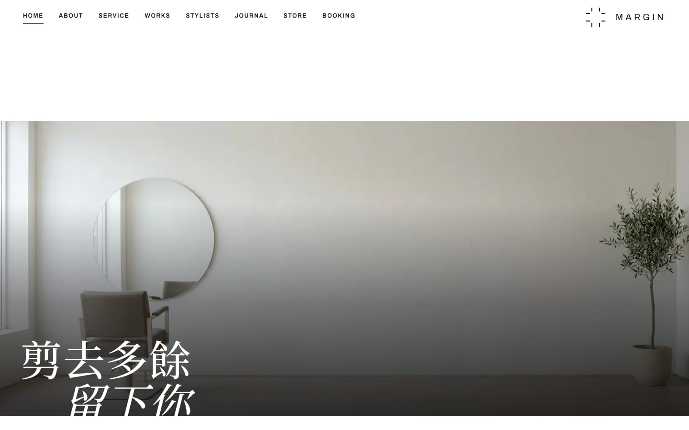
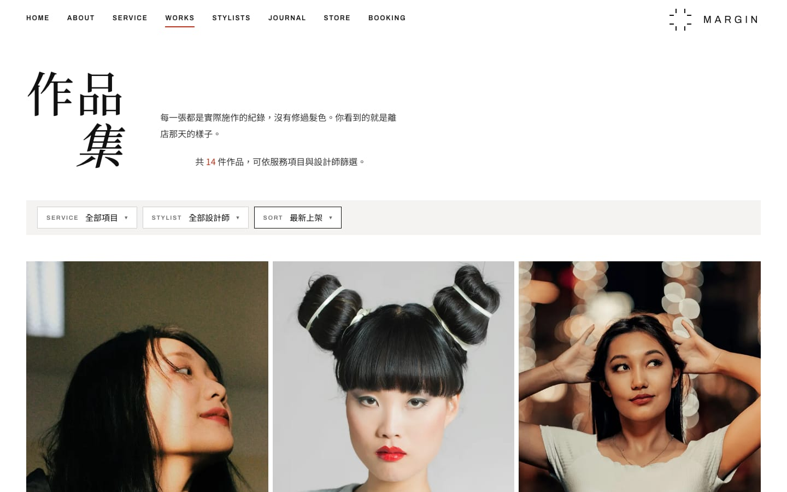
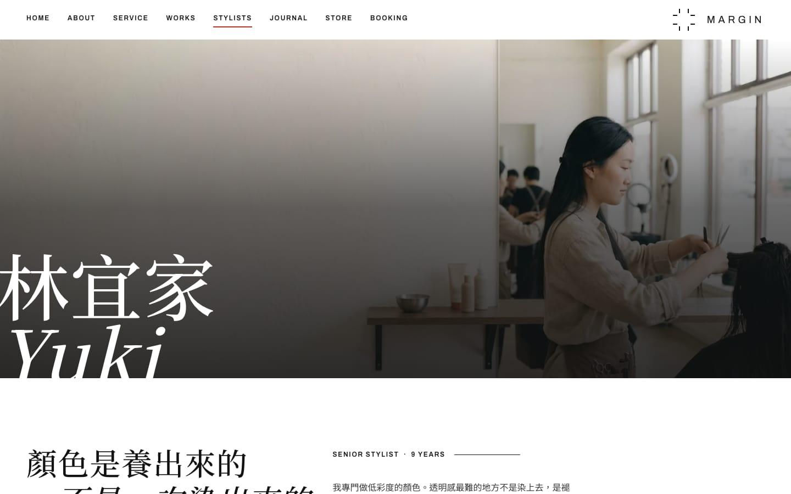
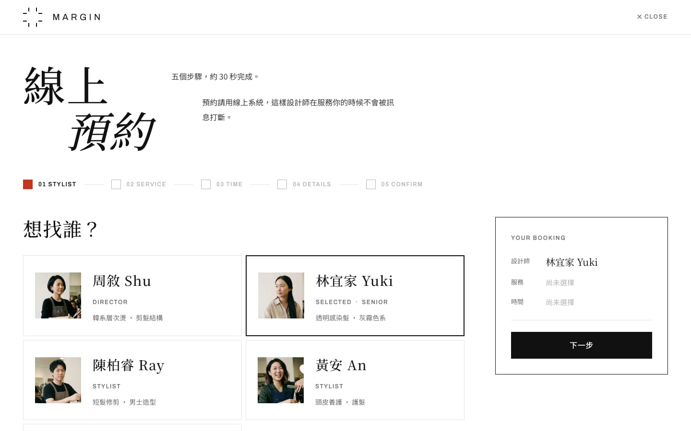
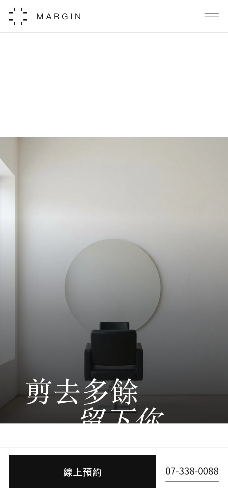
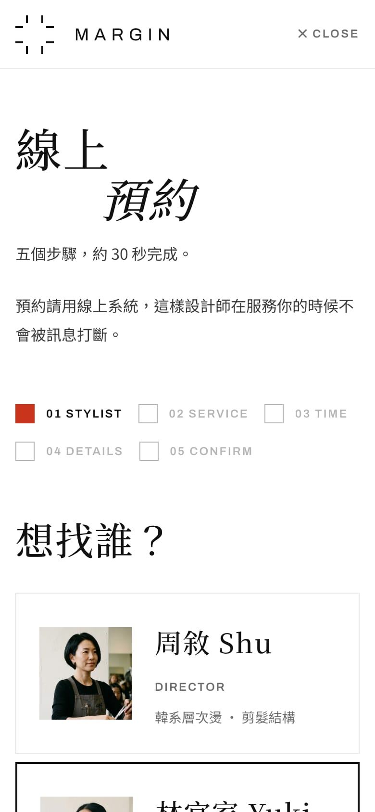

# 留白髮所 MARGIN

> **概念作品，非真實店家。** 品牌、店址、電話、設計師與影像皆為虛構示意，網站設定為不讓搜尋引擎收錄。

**線上網站：<https://margin-salon.momoopsoops.workers.dev/>**
預約流程可以實際走一遍；網站跑示範模式，不會寄信，也不會進任何人的行事曆。

一間虛構的高雄預約制美髮沙龍：從品牌定位、規格文件、設計系統，到一個能實際預約的網站。
「留白」是店名，也是整個網站的設計規格——一屏一件事、減法優先、每個區塊只有一個主按鈕。

- **[個案研究](docs/個案研究.md)**：要解決的問題、關鍵決策與代價、還沒做完的部分
- **[開發筆記](docs/開發筆記.md)**：架構、API、內容管理、預約與寄信的接法、部署



| 作品集 | 設計師個人頁 |
|---|---|
|  |  |
| **五步驟預約** | **手機版** |
|  |   |

## 看點

- **品牌原則寫成可檢查的規格。** 黑白＋單一強調色（只當狀態色，不當按鈕色）、無圓角無陰影、
  每個區塊最多一個主按鈕；23 支元件對應設計系統的元件規格。
- **自建五步驟預約。** 除了順利路徑，還設計了「當天排不下」「時段被搶走」「送出失敗」三種邊界狀態。
- **決策有紀錄。** PRD 裡 12 條決策記錄，每條寫明放棄了什麼、代價怎麼補。
- **細節有量測。** 影像上白字的對比逐張量過，最低從 1.6:1 修到全站 3.4:1 以上。

## 分工與 AI 的使用

| 部分 | 做法 |
|---|---|
| 規格文件（PRD、全站文案、SEO） | 我撰寫，AI 輔助整理與潤飾 |
| 高擬真稿、MARGIN 設計系統 | 我設計，以 Claude Design 輔助 |
| 網站程式（Nuxt 實作） | Claude Code 撰寫；我負責需求、審查、驗收與取捨決策 |
| 影像 | Gemini 生成空間、設計師與服務照；作品照暫用 Unsplash（來源見 [public/img/README.md](public/img/README.md)） |

## 技術

Nuxt 4、Vue 3、Tailwind CSS 4、TypeScript；Notion API、Google Calendar API、Resend；部署在 Cloudflare Workers。

## 在本機跑起來

```bash
npm install
npm run dev     # http://127.0.0.1:3000
```

不填任何金鑰也跑得起來（預約走示範空檔、不寄信）。建置、預覽與部署見[開發筆記](docs/開發筆記.md#本機建置與部署)。
